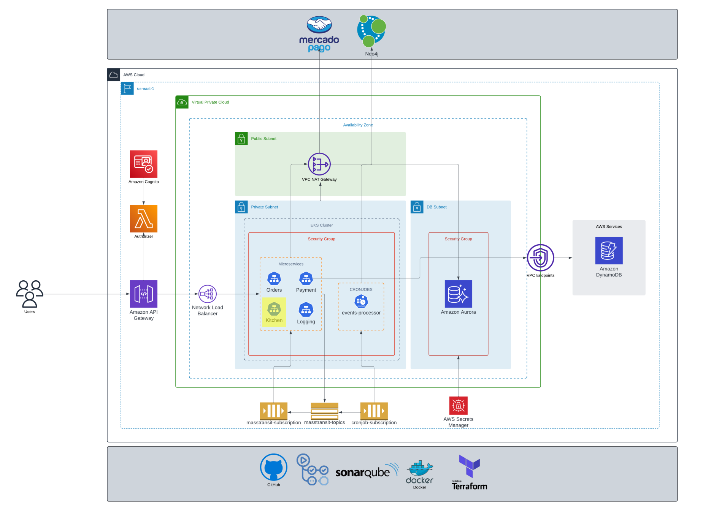
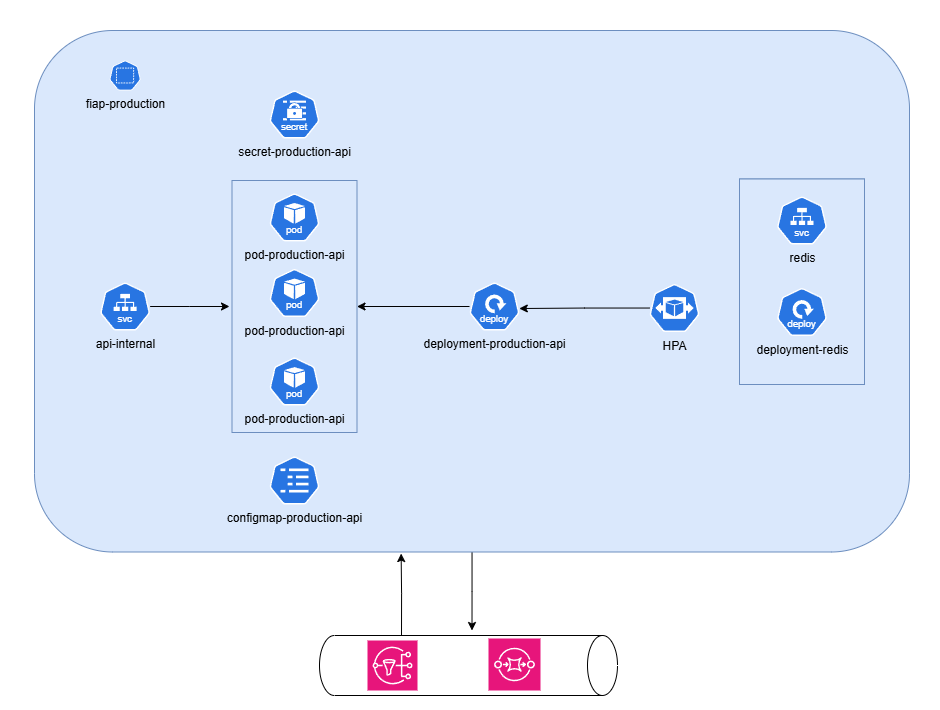

# bmb.production
Repository with Kitchen production line resources

[](https://sonarcloud.io/summary/new_code?id=soat-fiap_bmb.production)
[](https://sonarcloud.io/summary/new_code?id=soat-fiap_bmb.production)

## Event Subscriptions

### OrderCreated Event
- Subscribes to `OrderCreated` events.
- Adds the order to the orders list using the order ID as the key.

### OrderPaymentConfirmed Event
- Subscribes to `OrderPaymentConfirmed` events.
- If the orders list contains the received OrderId:
    - Adds `TrackingCode:OrderId` to the `Received` queue.

## Queues
- **Received**: Queue for orders that have been received.
- **InPreparation**: Queue for orders that are currently being prepared.
- **Ready**: Queue for orders that are ready for pickup or delivery.

## Endpoints

### List Orders
- **Endpoint**: Lists all orders.
- **Response Object**:
```json
{
  "received": [
    {
      "orderId": "b39c3d69-2e43-47df-8b86-0037975ae211",
      "code": "ASD-12"
    }
  ],
  "inPreparation":[
    {
      "orderId": "b33c3d69-2e43-47df-8b86-0037975ae211",
      "code": "ASD-12"
    }
  ],
  "ready": [
    {
      "orderId": "c39c3d69-2e43-47df-8b86-0037975ae211",
      "code": "ASD-22"
    }
  ],
}
```

### Update Order Status
- **Endpoint**: Updates the status of an order.
- **Request Parameters**:
    - `trackingCode`: The tracking code of the order.
    - `status`: The new status of the order. Valid statuses are `InPreparation`, `Ready`, or `Completed`.
- **Status Change Rules**:
    - Status transitions must follow the sequence: `Received` -> `InPreparation` -> `Ready` -> `Completed`.
    - Status changes cannot be rolled back.
    - If the order status is `Completed`, it should be removed from the orders list.
- **Events**:
    - An `OrderStatusChanged` event should be triggered on every status change operation.

# Use Cases

## ReceiveOrderUseCase
- **Trigger**: Executed from the `OrderPaymentConfirmed` event.
- **Actions**:
  - Adds the order to the `Received` queue.
  - Publishes an `OrderStatusChanged` event with the status value `Received`.

## PrepareOrderUseCase
- **Trigger**: Executed when an order needs to be prepared.
- **Actions**:
  - Removes the order from the `Received` queue.
  - Adds the order to the `InPreparation` queue.
  - Publishes an `OrderStatusChanged` event with the status value `InPreparation`.

## FinishOrderPreparationUseCase
- **Trigger**: Executed when an order preparation is finished.
- **Actions**:
  - Removes the order from the `InPreparation` queue.
  - Adds the order to the `Ready` queue.
  - Publishes an `OrderStatusChanged` event with the status value `Ready`.

## CompleteOrderUseCase
- **Trigger**: Executed when an order is completed.
- **Actions**:
  - Removes the order from the `Ready` queue.
  - Removes the order from the list.
  - Publishes an `OrderStatusChanged` event with the status value `Completed`.

## This repo on the infrastructure



### K8S
